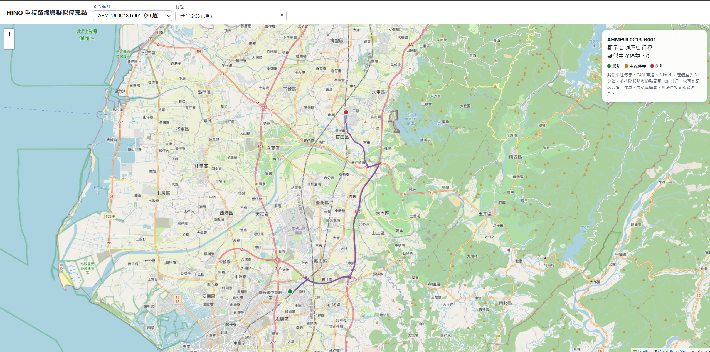
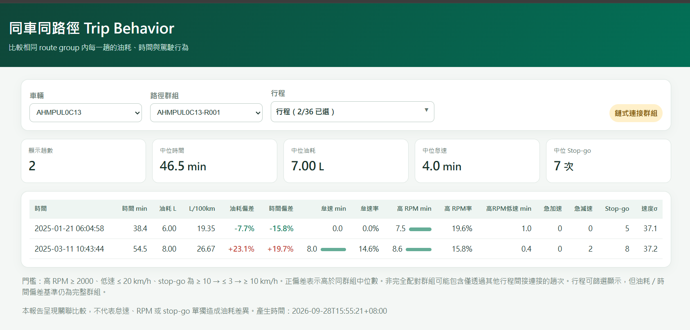

# Hino-ai

HINO 車輛行程資料分析專案，提供從原始 Excel 到路線分群、互動式地圖與 Trip Behavior 報告的完整流程。

## 專案目標

- 分析 HINO 車輛的行程與駕駛資料。
- 建立相同車輛、相同路線的 route group。
- 產生 GPS 路徑與疑似中途停靠點地圖。
- 比較同車同路徑內各趟行程的油耗、時間與駕駛行為差異。

## 比賽時程

以下為專案時程與工作規劃總覽：


## 資料分析流程

```text
原始 Excel
   ↓
資料剖析與欄位驗證
   ↓
行程、GPS、CAN 訊號與事件整理
   ↓
路線配對與 route group 建立
   ↓
互動式路徑地圖
   ↓
Trip Behavior 指標分析
   ↓
CSV、JSON、HTML 報告
```

## 路徑地圖成果



路徑地圖可以：

- 依車輛與路線群組查看行程。
- 同時比較多趟 GPS 路徑。
- 顯示每趟行程的起點與終點。
- 顯示符合條件的疑似中途停靠點。

疑似停靠點僅代表車輛在該位置附近維持低速一段時間，不代表一定是客戶地點或裝卸貨地點。

產出檔案：

- [`route_stop_map.html`](data/processed/analysis/route_stop_map.html)

## Trip Behavior 成果



Trip Behavior 報告比較同一台車、同一個 route group 內各趟行程的：

- 怠速時間與怠速比例。
- 高 RPM 時間與比例。
- 高 RPM 加低速時間。
- Excel 官方事件 6：急加速。
- Excel 官方事件 7：急減速。
- Stop-and-go 次數。
- 時間加權車速標準差。
- 相對同群組中位數的油耗與時間偏差。

產出檔案：

- [`trip_behavior_report.html`](trip_behavior/output/trip_behavior_report.html)：可依車輛、路徑群組與行程篩選的離線報告。
- [`trip_behavior_metrics.csv`](trip_behavior/output/trip_behavior_metrics.csv)：每趟行程一列的完整指標與品質欄位。
- [`trip_behavior_summary.json`](trip_behavior/output/trip_behavior_summary.json)：門檻、來源、處理筆數與資料對帳摘要。

## 主要程式

### `backend/scripts/data_pipeline`

- [`profile_hino.py`](backend/scripts/data_pipeline/profile_hino.py)：建立原始 Excel 資料概況。
- [`verify_topics.py`](backend/scripts/data_pipeline/verify_topics.py)：整理行程、事件、路線候選與主題驗證資料。
- [`verify_route_pairs.py`](backend/scripts/data_pipeline/verify_route_pairs.py)：計算候選路線的雙向 GPS 覆蓋率。
- [`summarize_route_groups.py`](backend/scripts/data_pipeline/summarize_route_groups.py)：依路線重疊與驗證結果建立 route groups。
- [`build_route_stop_map.py`](backend/scripts/data_pipeline/build_route_stop_map.py)：串流讀取 GPS 點，建立互動式路徑與停靠點地圖。

### `backend/scripts/route_poc`

- [`extract_trip.py`](backend/scripts/route_poc/extract_trip.py)：從 Excel 擷取指定車輛與行程。
- [`build_route_poc.py`](backend/scripts/route_poc/build_route_poc.py)：建立路線、海拔、油耗與成本比較結果。

### `trip_behavior`

- [`analyze_trip_behavior.py`](trip_behavior/analyze_trip_behavior.py)：計算每趟行程的怠速、高 RPM、急加減速、stop-go、車速波動與群組偏差。
- [`trip_behavior/README.md`](trip_behavior/README.md)：Trip Behavior 的完整欄位定義、門檻與限制。
- `output/`：保存 CSV、JSON 與 HTML 分析結果。

更多資料處理腳本與執行說明請參考 [`backend/scripts/README.md`](backend/scripts/README.md)。

## 常用執行指令

以下指令都從專案根目錄執行。請將 `--source` 替換成實際的原始 Excel 路徑。

### Trip Behavior 分析

```powershell
python trip_behavior\analyze_trip_behavior.py `
  --source "hino\output data_Hotai_20260511.xlsx" `
  --route-members "data\processed\analysis\route_group_members.csv" `
  --route-groups "data\processed\analysis\route_groups.csv" `
  --output-dir "trip_behavior\output"
```

### 建立路線群組地圖

```powershell
python backend\scripts\data_pipeline\build_route_stop_map.py `
  --source "hino\output data_Hotai_20260511.xlsx" `
  --members "data\processed\analysis\route_group_members.csv" `
  --output "data\processed\analysis\route_stop_map.html"
```

### 以本機 HTTP server 開啟互動頁面

```powershell
python -m http.server 8000
```

然後開啟：

- `http://localhost:8000/data/processed/analysis/route_stop_map.html`
- `http://localhost:8000/trip_behavior/output/trip_behavior_report.html`

路徑地圖使用 OpenStreetMap tiles，建議透過 localhost 開啟，不要直接使用 `file://`，以避免地圖 tile 請求缺少有效來源資訊。

## 輸出與限制

- 原始 Excel 僅供讀取，分析流程不會修改或覆寫原始資料。
- CSV、JSON 與 HTML 是可重新產生的分析產物。
- 油耗與駕駛行為是同車同路徑的關聯比較，不代表單一行為必然造成油耗差異。
- 交通狀況、載重、天氣、道路條件與駕駛人等因素都可能影響結果。
- 急加速與急減速使用 Excel 官方事件 6、7；報告不自行推測車機事件的內部判定門檻。
- 詳細的資料欄位、計算公式、品質欄位與分析限制請參考 [`trip_behavior/README.md`](trip_behavior/README.md)。
